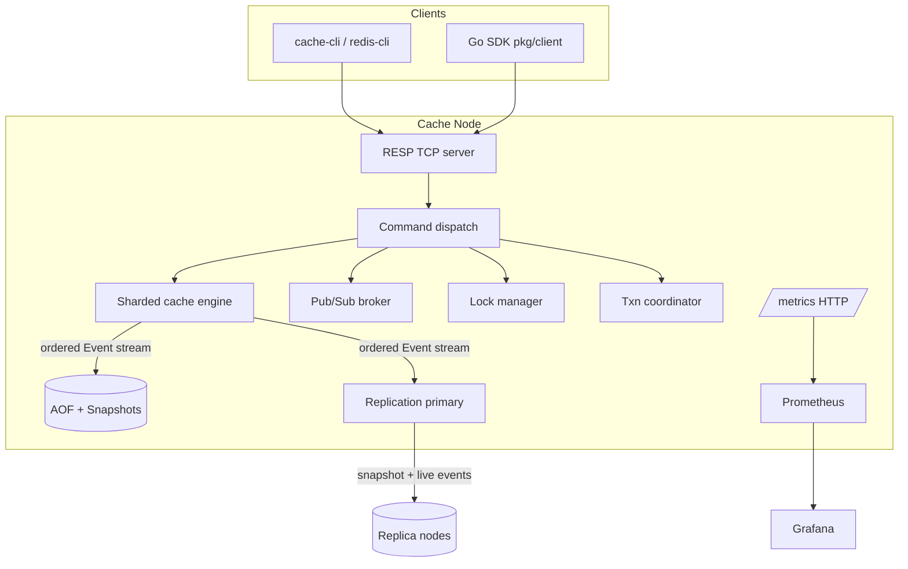

# distcache — Distributed In-Memory Cache Platform

A production-style, Redis-like distributed cache written in **pure Go** (standard
library only — no third-party runtime dependencies). It speaks the **RESP2**
wire protocol, so `redis-cli` and existing Redis clients can talk to it, and
ships with sharding, eviction, persistence, pub/sub, distributed locks,
transactions, asynchronous replication, consistent-hash clustering, and a
Prometheus/Grafana monitoring stack.

---

## Features

| Area | What's implemented |
| --- | --- |
| **Core cache** | Binary-safe `GET/SET/DEL/EXISTS`, atomic counters (`INCR/DECR/INCRBY/DECRBY`), batch `MSET/MGET`, `KEYS`, `TYPE`, `DBSIZE`, `FLUSHALL` |
| **TTL / expiry** | `EXPIRE/PEXPIRE/TTL/PTTL/PERSIST`, `SET ... EX/PX`, lazy + active background expiry |
| **Sharding** | Power-of-two shard count, per-shard locks for concurrency; keys mapped with `maphash` |
| **Eviction** | `noeviction`, `LRU`, `LFU` (O(1)), `FIFO`, `Random`, `TTL`, with entry- and memory-based caps |
| **Persistence** | Append-only file (AOF) with `no`/`everysec`/`always` fsync + periodic snapshots + crash-safe recovery |
| **Replication** | Asynchronous primary → replica: full snapshot sync, then live event streaming with lag tracking |
| **Clustering** | Consistent hashing with virtual nodes; server-side registry + client-side routing |
| **Pub/Sub** | `SUBSCRIBE/UNSUBSCRIBE/PUBLISH` with non-blocking fan-out |
| **Distributed locks** | `LOCK/UNLOCK/RENEWLOCK` with lease expiry and fencing tokens |
| **Transactions** | `MULTI/EXEC/DISCARD/WATCH/UNWATCH` optimistic (CAS) transactions |
| **Monitoring** | Prometheus text metrics over HTTP `/metrics`, `/health`, `INFO`, `CLUSTER`, Grafana dashboard |
| **Security** | Optional `AUTH` password gating |

---

## Architecture



The cache engine emits a single **totally-ordered mutation event stream**. A
dedicated dispatcher goroutine assigns each event a sequence number *after*
fanning it out, so the sequence order is identical to the AOF append order and
the replication stream order. Persistence and replication are both just
subscribers to that stream, which keeps recovery and replica state provably
consistent (every event with `Seq <= snapshotBoundary` is in the snapshot;
everything after is replayed from the log/stream).

---

## Project layout

```
cmd/
  cache-server/     # the node binary (RESP + metrics + persistence + repl + cluster)
  cache-cli/        # interactive REPL / one-shot client
internal/
  cache/            # sharded, thread-safe cache engine + event stream
  eviction/         # LRU / LFU / FIFO / Random / TTL policies
  persistence/      # AOF + snapshot + crash-safe recovery
  pubsub/           # topic broker
  locks/            # lease-based distributed locks with fencing tokens
  txn/              # MULTI/EXEC/WATCH optimistic transactions
  hashring/         # consistent hashing with virtual nodes
  cluster/          # node registry + ownership/liveness
  replication/      # primary/replica async replication
  resp/             # RESP2 codec (server + client)
  metrics/          # Prometheus text-format exposition
  server/           # RESP front-end wiring everything together
pkg/
  client/           # Go client SDK + cluster-routing client
deploy/             # docker-compose, Prometheus, Grafana provisioning
Dockerfile
```

---

## Build & run

Requires Go 1.26+.

```powershell
# Build both binaries
go build ./...
```

Run a single node locally:

```powershell
go run ./cmd/cache-server -addr :6380 -metrics-addr :9121 -policy lru
```

Talk to it with the bundled CLI (or `redis-cli -p 6380`):

```powershell
go run ./cmd/cache-cli -addr 127.0.0.1:6380
127.0.0.1:6380> SET greeting "hello world"
OK
127.0.0.1:6380> GET greeting
"hello world"
127.0.0.1:6380> INCR counter
(integer) 1
```

---

## Testing

The project ships with an extensive automated test suite plus repeatable manual
scenarios for the distributed behaviours that are awkward to assert in a unit
test (replication, crash recovery, cluster routing, monitoring).

### Run the automated suite

```powershell
# Everything, with the race detector (recommended)
go test -race ./...

# With per-package coverage
go test -race -cover ./...

# A single package
go test -race ./internal/replication/

# A single test, verbose
go test -race -run TestReplicaDisconnectAndResync -v ./internal/replication/

# HTML coverage report for one package
go test -coverprofile=cover.out ./internal/cache/
go tool cover -html=cover.out
```

Static checks used in CI-style runs:

```powershell
gofmt -l .   # should print nothing
go vet ./...
```

### Coverage snapshot

| Package | Coverage | Package | Coverage |
| --- | --- | --- | --- |
| `internal/metrics` | 100% | `internal/cache` | 79% |
| `internal/hashring` | 98% | `pkg/client` | 79% |
| `internal/locks` | 98% | `internal/server` | 75% |
| `internal/pubsub` | 98% | `internal/persistence` | 69% |
| `internal/cluster` | 90% | `cmd/cache-cli` | 34% |
| `internal/txn` | 91% | `cmd/cache-server` | 15% |
| `internal/eviction` | 88% | `internal/replication` | 82% |
| `internal/resp` | 81% | | |

`cmd/*` coverage is intentionally low: those numbers cover pure functions
(`buildRegistry`, `render`); the remaining `main()` code is flag/socket/signal
wiring exercised by the manual scenarios below.

### How the tests are written

- **Real servers on ephemeral ports.** Server/replication/client tests bind
  `127.0.0.1:0` and call the public `Serve(ln)` method, so they exercise the
  actual RESP wire path rather than mocks.
- **Injectable clocks.** The cache engine, lock manager, and cluster registry
  accept a clock function, making TTL, lease-expiry, and liveness tests
  deterministic (no `time.Sleep` for correctness).
- **`Sync()` barrier.** Tests that assert on the event stream drain the
  dispatcher via `cache.Sync()` for a race-free boundary.

### Scenario guides

Two folder-level guides walk through testing each subsystem end to end:

- [internal/README.md](internal/README.md) — the **unit-test map**: which file
  covers which package, the scenarios each asserts, and how to run/inspect them.
- [deploy/README.md](deploy/README.md) — **integration scenarios** against a
  live Docker cluster: replication lag, replica resync, crash recovery,
  cluster routing, pub/sub, locks, transactions, and monitoring.
- [MANUAL_TEST_SCENARIOS.md](MANUAL_TEST_SCENARIOS.md) — **local step-by-step manual scenarios**
  we validated interactively (basic commands, TTL behavior, expected outputs,
  and practical troubleshooting notes such as port conflicts and `go run` timing).

---

## Running the full cluster (Docker)

Brings up a 3-node cluster (one primary + two replicas), Prometheus, and a
provisioned Grafana dashboard:

```powershell
docker compose -f deploy/docker-compose.yml up --build
```

| Service | Address |
| --- | --- |
| cache-1 (primary) | `localhost:6380` (metrics `:9121`) |
| cache-2 (replica) | `localhost:6381` (metrics `:9122`) |
| cache-3 (replica) | `localhost:6382` (metrics `:9123`) |
| Prometheus | `localhost:9090` |
| Grafana | `localhost:3000` (admin / admin) |

Write to the primary, read from a replica:

```powershell
go run ./cmd/cache-cli -addr 127.0.0.1:6380 SET user:1 "alice"
go run ./cmd/cache-cli -addr 127.0.0.1:6381 GET user:1   # served from a replica
```

---

## Server flags

| Flag | Default | Description |
| --- | --- | --- |
| `-addr` | `:6380` | RESP listen address |
| `-metrics-addr` | `:9121` | Prometheus `/metrics` + `/health` HTTP address (empty disables) |
| `-password` | _(none)_ | Require `AUTH` before data commands |
| `-node-id` | `node-1` | Node identifier for `INFO`/metrics |
| `-shards` | `256` | Number of cache shards (rounded to power of two) |
| `-max-memory-mb` | `0` | Soft memory cap in MiB (0 = unlimited) |
| `-max-entries` | `0` | Soft cap on live keys (0 = unlimited) |
| `-policy` | `lru` | `noeviction`/`lru`/`lfu`/`fifo`/`random`/`ttl` |
| `-data-dir` | _(none)_ | Persistence directory (empty = in-memory only) |
| `-aof-sync` | `everysec` | AOF fsync policy: `no`/`everysec`/`always` |
| `-snapshot-interval` | `5m` | Background snapshot interval (0 disables) |
| `-active-expiry` | `1s` | Background expired-key sweep interval (0 disables) |
| `-repl-listen` | _(none)_ | Address to accept replica connections (makes node a primary) |
| `-replicaof` | _(none)_ | Primary address to replicate from (makes node a replica) |
| `-cluster` | _(none)_ | Topology `id=addr,id=addr,...` to enable `CLUSTER` |
| `-replication-factor` | `1` | Cluster replication factor |

---

## Command reference

**Strings / keys:** `SET key val [EX s|PX ms]`, `GET`, `DEL key...`,
`EXISTS key...`, `MSET k v ...`, `MGET k...`, `TYPE`, `KEYS pattern`, `DBSIZE`,
`FLUSHALL`
**Counters:** `INCR`, `DECR`, `INCRBY key n`, `DECRBY key n`
**Expiry:** `EXPIRE key s`, `PEXPIRE key ms`, `TTL`, `PTTL`, `PERSIST`
**Pub/Sub:** `SUBSCRIBE topic...`, `UNSUBSCRIBE [topic...]`, `PUBLISH topic msg`
**Locks:** `LOCK key ttlSeconds [owner]` → fencing token, `UNLOCK key token`,
`RENEWLOCK key token ttlSeconds`
**Transactions:** `MULTI`, `EXEC`, `DISCARD`, `WATCH key...`, `UNWATCH`
**Admin:** `AUTH password`, `PING`, `ECHO`, `INFO`, `CLUSTER INFO|NODES|MYID`,
`COMMAND`, `QUIT`

---

## Go client SDK

Single node:

```go
c, err := client.Dial("127.0.0.1:6380")
if err != nil { log.Fatal(err) }
defer c.Close()

_ = c.Set("k", []byte("v"))
val, ok, _ := c.Get("k")
n, _ := c.Incr("counter")
token, held, _ := c.Lock("job", 30*time.Second, "worker-1")
```

Consistent-hash routing across a cluster:

```go
cc, _ := client.NewCluster(map[string]string{
    "cache-1": "127.0.0.1:6380",
    "cache-2": "127.0.0.1:6381",
    "cache-3": "127.0.0.1:6382",
}, "")
defer cc.Close()

_ = cc.Set("user:42", []byte("bob")) // routed to the owning node
v, ok, _ := cc.Get("user:42")
```

Streaming pub/sub:

```go
sub, _ := client.Subscribe("127.0.0.1:6380", "", "news")
defer sub.Close()
for msg := range sub.Messages() {
    fmt.Printf("%s -> %s\n", msg.Topic, msg.Payload)
}
```

---

## Persistence & recovery

With `-data-dir` set, every mutation is appended to `appendonly.aof` and a
compacting snapshot (`snapshot.db`) is written periodically. On startup the node
loads the snapshot, then replays only the AOF records newer than the snapshot's
boundary sequence. Torn trailing records (from a crash mid-write) are detected
via length framing and safely ignored.

## Replication

A primary (`-repl-listen`) streams a full snapshot to each connecting replica,
emits a `SYNCED` boundary marker, then forwards the live event stream. Replicas
apply events idempotently and periodically acknowledge their applied sequence so
the primary can report replication lag (`INFO` → `# Replication`). A replica that
falls too far behind is disconnected and performs a fresh full resync on
reconnect.

## Monitoring

Each node exposes Prometheus metrics at `/metrics` — command throughput and
latency histogram, hit ratio, key/memory gauges, evictions/expirations,
connections, network I/O, pub/sub volume, and cluster topology. The bundled
Grafana dashboard (auto-provisioned) visualizes all of these per node.

---

## Design notes

- **Ordered event stream + fuzzy snapshots.** Sequence numbers are assigned on a
  single dispatcher goroutine after fan-out, guaranteeing `Seq` order equals AOF
  append order and replication order. This makes snapshot + log/stream recovery
  correct without pausing writes.
- **`Sync()` barrier.** An ack-event flushed through the event channel drains the
  dispatcher, giving persistence and `WATCH` a clean, race-free boundary.
- **Injectable clock.** The engine and lock/registry components accept a clock
  function for deterministic tests.
- **No external dependencies.** RESP, Prometheus exposition, consistent hashing,
  and replication framing are all hand-rolled against the standard library.
